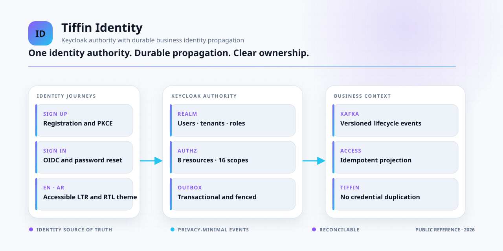
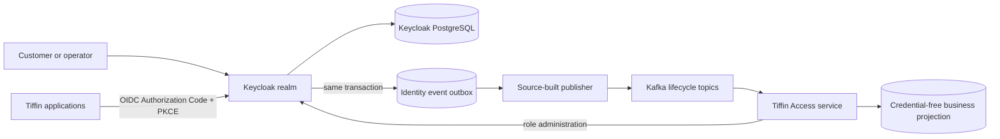

<div align="center">

# Tiffin Keycloak

**The identity, authorization seed, lifecycle-event provider, and authentication theme for Tiffin.**

Keycloak is the source of truth for users and credentials. Tiffin receives privacy-minimal,
durably published identity lifecycle events for its business projection.

[](https://github.com/panahister/tiffin-keycloak/actions/workflows/ci.yml)
[](LICENSE)
[](product/tiffin-local/docker/Dockerfile)
[](#project-status)

[Architecture](docs/ARCHITECTURE.md) ·
[Authorization model](docs/AUTHORIZATION.md) ·
[Customization](docs/CUSTOMIZATION.md) ·
[Tiffin backend](https://github.com/panahister/mpcore-tiffin-sample) ·
[MP ecosystem](https://github.com/panahister/mpcore/blob/main/docs/architecture/ecosystem.md)

</div>

<picture>
  <source media="(prefers-color-scheme: dark)" srcset="docs/images/ecosystem-dark.svg">
  <source media="(prefers-color-scheme: light)" srcset="docs/images/ecosystem-light.svg">
  
</picture>

This repository is the complete Tiffin-specific Keycloak source boundary used by the MP Core food-
delivery reference. It contains the realm import, deterministic authorization seed, custom login/account
theme, PostgreSQL outbox migrations, and a source-built Keycloak event-listener provider.

There is intentionally no role or permission editor in the Tiffin operations UI. Identity, roles,
resources, scopes, and role assignments are administered through reviewed source here or the Keycloak
Admin Console. Product services consume the resulting identity and authorization contracts.

## What it demonstrates

| Concern | Implementation |
|---|---|
| Identity ownership | Signup, login, password reset, credentials, and profile lifecycle stay in Keycloak |
| Product projection | Versioned lifecycle events let Tiffin maintain an idempotent credential-free business user keyed by Keycloak subject |
| Delivery guarantee | Event capture shares Keycloak's database transaction; a fenced PostgreSQL outbox publishes to Kafka |
| Authorization seed | Five business roles, eight resources, sixteen scopes, and twenty role/resource permissions |
| Tenant claim | Seattle, Austin, and platform groups issue the bounded `tenant_id` claim |
| Service identity | Dedicated service accounts and audiences for least-privilege service-to-service calls |
| Authentication UX | Responsive Tiffin login, registration, password recovery, account, English, Arabic, LTR, and RTL |
| Failure behavior | Bounded backlog, claim renewal/generation fencing, retry, dead letter, readiness marker, and sanitized error classes |

## Architecture at a glance



The event payload excludes credentials and unnecessary profile data. Consumers use the immutable
Keycloak subject as their identity key and treat duplicate events idempotently. A periodic reconciliation
in the backend repairs missed delivery or realm-import gaps without creating a second identity authority.

## Repository map

```text
product/tiffin-local/import/          realm, clients, groups, users, and development identities
product/tiffin-local/authorization-state.json
                                      reviewed roles, resources, scopes, and permissions
product/tiffin-local/docker/          source image, topic preparation, and local migration adapter
provider/                             Java event listener and transactional outbox publisher
db/migrations/                        versioned PostgreSQL outbox schema
scripts/tiffin_authorization.py       validate or idempotently apply authorization state
scripts/migrate-postgres.sh           checksum-locked migration runner
themes/tiffin/                        login and account themes
tests/                                repository, localization, and public-boundary checks
```

## Verify the source

Python validation requires no third-party package:

```bash
python3 scripts/tiffin_authorization.py validate
python3 -m unittest discover -s tests -v
```

Build the exact source image and run the provider self-test:

```bash
docker build \
  --file product/tiffin-local/docker/Dockerfile \
  --tag tiffin-keycloak:local \
  .
```

The build downloads Kafka Clients `4.3.1` from Maven Central with a pinned SHA-256 checksum, compiles the
provider against Keycloak `26.7.3`, runs the Java self-test, creates a reproducible provider JAR, and runs
Keycloak's optimized build.

## Run with Tiffin

The integrated PostgreSQL, Kafka, topic provisioning, migrations, realm import, theme mount, and Keycloak
health checks live in [mpcore-tiffin-sample](https://github.com/panahister/mpcore-tiffin-sample). Clone
this repository as a sibling named `tiffin-keycloak`, then follow that repository's running guide.

The local realm deliberately contains low-value `*-lab` credentials and `lab-only-*` client secrets so
the public POC is immediately reproducible. They are not defaults, examples, or acceptable values for any
shared or production environment.

## Seeded demo identities

| Username | Role | Tenant | Intended use |
|---|---|---|---|
| `olivia`, `ethan` | Customer | Seattle | Customer journeys |
| `emma` | Customer | Austin | Tenant-isolation customer journey |
| `madison` | Restaurant manager | Seattle | Restaurant and kitchen operations |
| `mason` | Restaurant manager | Austin | Tenant-isolation operations |
| `noah` | Courier | Seattle | Dispatch, position, and delivery |
| `ava` | City administrator | Seattle | Access/governance API |
| `logan` | City administrator | Austin | Access/governance API |
| `grace` | Platform administrator | Platform | Cross-city governance API |

Passwords follow `<username>-lab` and exist only in the local realm import. City and platform
administrators are governance users; they do not automatically receive restaurant or courier UI
capabilities.

## Project status

This is a public reference proof of concept. The source image, provider self-test, authorization seed,
theme/localization tests, real signup-to-business projection, and idempotent role scenarios have been run
in the local Tiffin stack. Production realm hardening, managed secrets, TLS, Kafka authentication, HA,
backup/restore, email verification, vulnerability acceptance, and operational SLOs remain deployment-
specific gates.

## Contributing and security

Read [CONTRIBUTING.md](CONTRIBUTING.md). Report vulnerabilities privately through
[SECURITY.md](SECURITY.md). Participation is governed by [CODE_OF_CONDUCT.md](CODE_OF_CONDUCT.md).

## License

Licensed under [Apache License 2.0](LICENSE). Demo identities and organizations are fictional.
