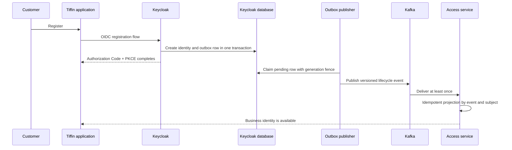

# Architecture

Tiffin uses Keycloak as its identity source of truth and a backend Access service as an anti-corruption
layer for business role administration. Authentication does not pass through Access. Every application
uses OIDC directly through its Security BFF, and every domain service validates the resulting token.

## Identity ownership

| Data or operation | Owner |
|---|---|
| Subject, username, email, credential, password reset, enabled state | Keycloak |
| Realm roles, group membership, token audiences, tenant claim | Keycloak |
| Business user projection keyed by Keycloak subject | Tiffin Access service |
| Orders, restaurants, deliveries, notifications, and media relationships | Owning Tiffin service |

The business projection contains no credential and is not a second signup source. It exists so domain
records can use a stable local business identity while Keycloak remains authoritative.

## Signup and projection flow

The outbox uses `FOR UPDATE SKIP LOCKED`, a worker identity, a claim generation, and lease renewal. An
acknowledge, retry, or dead-letter transition succeeds only for the current claim owner and generation.
This prevents a slow or replaced worker from finalizing another worker's claim.

## Event boundary

Events use CloudEvents-compatible metadata and versioned `data` payloads. The provider emits dedicated
user, admin, and security streams plus a dead-letter stream. Kafka records include `ce_id`,
`ce_specversion`, schema version, and publish time headers.

Privacy rules are applied before the outbox row is written. Payloads never contain passwords, credential
material, access tokens, refresh tokens, or complete admin representations. Logs contain event kind and a
sanitized exception class, not payloads or credentials.

## Failure model

| Failure | Behavior |
|---|---|
| Kafka unavailable | Event remains pending and is retried with bounded exponential backoff |
| Publisher stops after send | Duplicate publication is possible; event ID makes the consumer idempotent |
| Claim holder stalls | Lease expires; a new generation may reclaim the row |
| Repeated delivery failure | Sanitized dead-letter event is published, then the row is marked dead-lettered |
| Backlog exceeds count or age threshold | Readiness marker makes the identity runtime unready |
| Schema migration drifts | Checksum-locked migration runner refuses the changed version |
| Lifecycle event is missed by a consumer | Backend reconciliation rebuilds the projection from authoritative Keycloak state |

## Authorization model

The realm carries coarse business roles and tenant membership. `authorization-state.json` defines the
resource server's resources, scopes, and role-to-scope policies. `tiffin_authorization.py` validates a
closed schema and applies only the Tiffin-owned authorization surface idempotently.

Backend services still authorize every request. Keycloak Authorization Services describe and manage the
model; they do not replace service-level domain and tenant checks.

## Theme boundary

Keycloak owns login, registration, password recovery, and account pages. The theme keeps these identity
flows visually aligned with Tiffin without moving credential forms into the product application. Visible
text comes from Keycloak message bundles so locale changes affect the actual forms. CSS uses logical
properties for LTR/RTL and preserves accessible labels for icon-only controls.

## Deployment boundary

The public Dockerfile builds a pinned Keycloak image and provider. The Tiffin backend repository owns the
local integrated topology, database credentials, Kafka broker, topic bootstrap, environment, and health
checks. Production image signing, SBOM, vulnerability disposition, TLS, secret stores, Kafka ACLs,
replication, backup, and disaster recovery remain deployment responsibilities.
